<div align="center">

# 🔔 BuzzIn

**Real-time multiplayer game night, settled on Monad.**

A host opens a room. Players scan a QR code, sign in, and are handed an embedded wallet and a stake — no extension, no seed phrase, no faucet, no network switching. Everyone answers the same question at the same moment, an AI Game Master paces the difficulty from live room metrics, and the entire game settles on-chain in a single transaction.

[](https://nextjs.org)
[](https://react.dev)
[](https://www.typescriptlang.org)
[](https://monad.xyz)
[](https://supabase.com)
[](https://soliditylang.org)
[](#-testing--verification)
[](#-license)

</div>

---

## 📑 Table of Contents

| | | |
|---|---|---|
| [Overview](#-overview) | [Game Modes](#-game-modes) | [Architecture](#-architecture) |
| [Request Lifecycle](#-request-lifecycle) | [Game State Machine](#-game-state-machine) | [Time Model](#-the-time-model-no-worker-no-cron) |
| [Settlement Pipeline](#-settlement-pipeline) | [Auth & Wallets](#-authentication--embedded-wallets) | [Economy & Scoring](#-economy--scoring) |
| [Data Model](#-data-model) | [Smart Contract](#-smart-contract) | [API Reference](#-api-reference) |
| [Repository Layout](#-repository-layout) | [Configuration](#-configuration) | [Graceful Degradation](#-graceful-degradation) |
| [Security](#-security-model) | [Getting Started](#-getting-started) | [Testing](#-testing--verification) |
| [Deployment](#-deployment) | [Operations](#-operational-notes) | [License](#-license) |

---

## 🎯 Overview

BuzzIn is a full-stack, production-shaped Web3 game platform built on **Next.js 16 App Router**, **Supabase Postgres**, **Google Identity Services**, **Gemini**, and the **Monad** blockchain. Three game modes ship on one deterministic round engine.

### The core idea

> **Play is fast because the chain is not in the loop.** Balances, scores, penalties and eliminations are authoritative server-side accounting during the game. At the end, the server derives one deterministic payout table, escrows exactly that amount on Monad, freezes it, and opens pull-based claims.

### What each role sees

<table>
<tr><th width="33%">👤 Player</th><th width="33%">🎙️ Host</th><th width="33%">🛠️ Admin</th></tr>
<tr valign="top">
<td>

Scan → sign in → play.

A wallet is provisioned the instant they sign in. They never learn what an embedded wallet is, never hold gas, and cash out to any address they name.

</td>
<td>

Create a room, pick mode + topic, generate a question set with AI, review and approve it, put the QR on a screen, start.

Live leaderboard, per-player economics, AI decision history and a real event terminal on one dashboard.

</td>
<td>

Cross-room overview, live treasury accounting, which integrations are actually live vs. falling back, and destructive demo tooling.

Admin is an **explicit** grant — never implied by hosting.

</td>
</tr>
</table>

### Feature highlights

- ⚡ **Sub-second synchronised rounds** — every device sees the same question at the same moment, with countdowns corrected for device clock skew
- 🤖 **AI Game Master** — Gemini reads live room metrics each round and proposes the next difficulty and topic; it can *nudge* selection but can never inject unapproved content
- 🔐 **Server-authoritative by construction** — the client is an input device; it isn't even told whether its own answer was right until the round closes
- 🧮 **Exact bigint wei arithmetic** — `Σ prizes == pool` exactly, and `prizes + refunds == every MON locked`
- ⛓️ **One transaction per game**, never one per answer, with idempotent, double-claim-proof settlement
- 🪂 **Every external dependency is optional** — the app is fully playable with an empty `.env`
- 🎵 **Zero third-party media** — Songless clips are synthesised from public-domain melodies at build time
- 🧪 **156 unit/integration tests + 86 live HTTP flow checks + 16 on-chain guarantee checks**

---

## 🎮 Game Modes

All three run on the same round engine, the same scoring, the same settlement. Only the payload of a `Challenge` differs.

| Mode | What the player sees | Extra payload field |
|---|---|---|
| 🧠 **QUIZ** | A question and four options | — |
| 🎵 **SONGLESS** | An audio clip and four candidate titles | `audioUrl` — opaque filename such as `track-07.wav` so it cannot leak the answer |
| 🔤 **WORDLESS** | A masked monospace pattern and four candidate words | `pattern` |

Each mode has a seeded, pre-approved content pool in `lib/content/`, which is also the fallback whenever AI generation is unavailable.

---

## 🏗️ Architecture

### System architecture

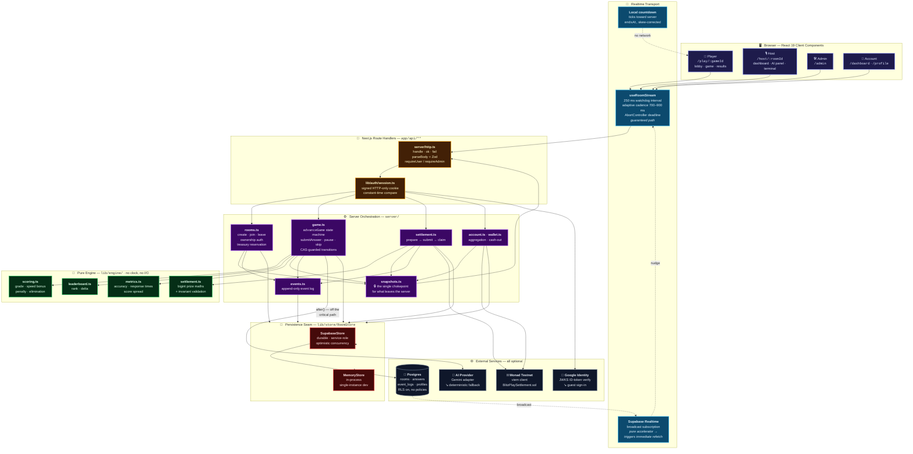

### The five decisions that shape everything

<table>
<tr><th width="4%">#</th><th width="30%">Decision</th><th>Why</th></tr>

<tr valign="top"><td><b>1</b></td><td><b>The server is the only authority</b></td>
<td>The client never decides correctness, score, penalty, elimination, rank, prize or settlement — and is not even told whether its own answer was right until the round closes. <code>buildPlayerSnapshot</code> in <code>server/snapshots.ts</code> is the single chokepoint for everything that leaves the server, and <code>tests/security.test.ts</code> asserts the answer key never appears in a live payload, an event log, or an audio filename.</td></tr>

<tr valign="top"><td><b>2</b></td><td><b>Time is driven by requests, not a worker</b></td>
<td>A background process would not survive serverless. Every round carries an absolute server <code>endsAt</code>, and <code>advanceGame()</code> is a pure function of <i>"what time is it now"</i> that <b>any</b> request can drive. The host dashboard ticks it; every player poll drives it too. The game keeps moving even if the host's tab is backgrounded.</td></tr>

<tr valign="top"><td><b>3</b></td><td><b>Contention is pushed into the database</b></td>
<td>Answers are append-only with a unique index on <code>(room_id, round_number, player_id)</code>. <i>That index</i> — not application logic — is what makes one-answer-per-round atomic with 25 phones firing at once. Room state is a single JSONB document touched only at round transitions, under optimistic concurrency on a <code>version</code> column.</td></tr>

<tr valign="top"><td><b>4</b></td><td><b>Polling is the transport; realtime is an accelerator</b></td>
<td>Adaptive polling is the guaranteed path. Supabase Realtime broadcast, when configured, only triggers an immediate refetch. Countdowns depend on neither — they tick locally toward a server deadline, so the timer stays smooth between fetches and correct across a reconnect.</td></tr>

<tr valign="top"><td><b>5</b></td><td><b>Every dependency is optional, every fallback is visible</b></td>
<td>No Google client id → guest sign-in. No AI key → deterministic Game Master. No Supabase → in-memory store. No treasury/contract → <code>OFF_CHAIN</code> settlement. The admin dashboard shows which are actually live, so a fallback is never mistaken for the real thing.</td></tr>
</table>

---

## 🔄 Request Lifecycle

What actually happens when a player taps an answer — and how one ordinary poll ends up grading the round for everybody.

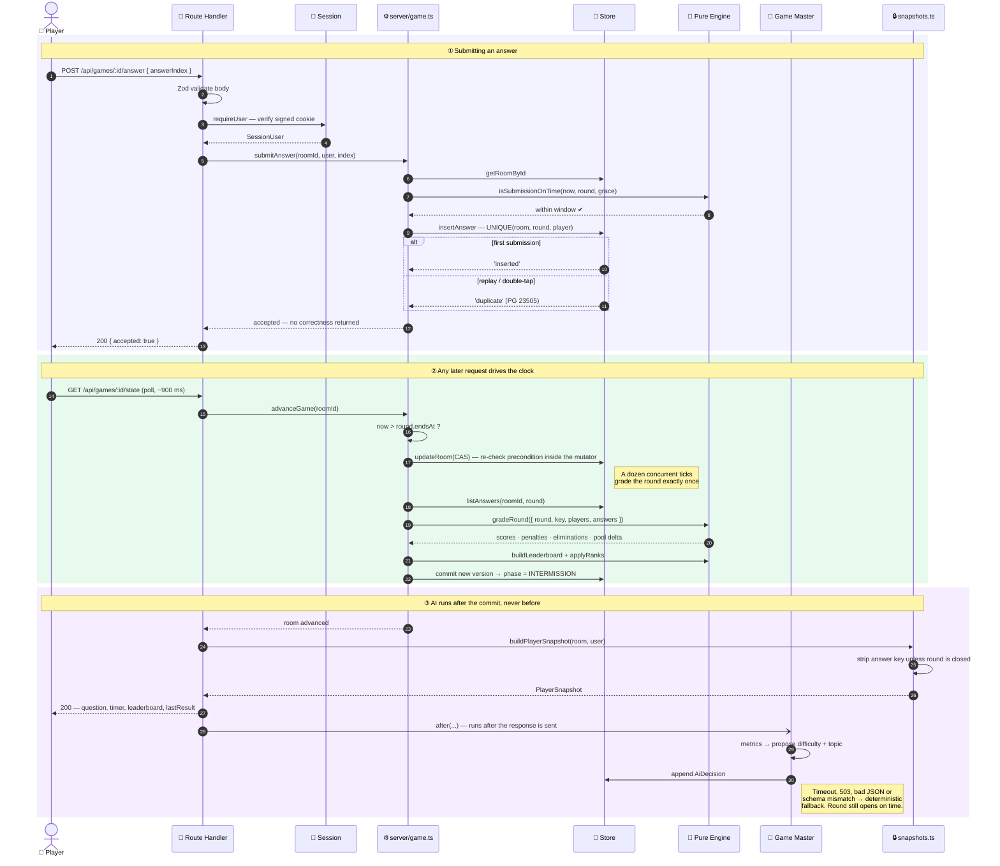

**The critical property:** grading is usually triggered by an ordinary player's state poll. That is why the Game Master runs inside `next/server`'s `after()` — its latency used to land as dead air after every round and freeze the unlucky poller's screen while everyone else moved on.

---

## 🎲 Game State Machine

`RoomStatus` tracks lifecycle; `EnginePhase` tracks what is on screen right now.

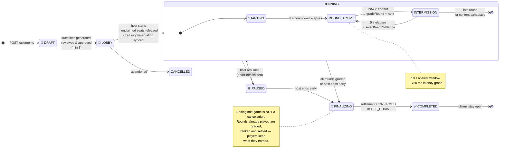

> **Where to be careful:** every branch of `advanceGame` must re-check its own precondition *inside* the CAS mutator, or concurrent ticks will double-apply. `beginRound` distinguishes `raced` (yield — someone else committed the transition) from `exhausted` (finish the game). Collapsing those two into a single null return once ended every game after round one.

---

## ⏱️ The Time Model — no worker, no cron

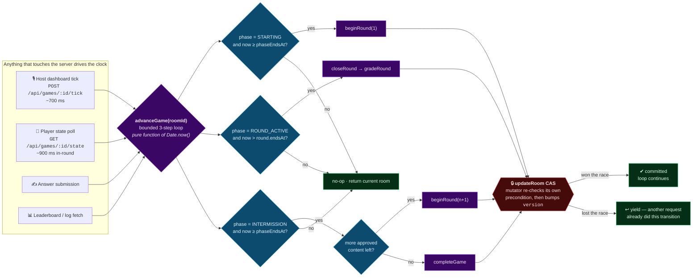

**Why a watchdog, not a timeout chain.** `useRoomStream` used to schedule itself with chained `setTimeout`s guarded by an `inFlight` boolean. A chain has exactly one live link, and a `fetch` that never settles — which is what a backgrounded or frozen tab produces — leaves `inFlight` stuck true, so every later call returns immediately and the room silently stops updating. The only cure available to the player was a page reload. It is now a **single repeating 250 ms interval** that re-decides, every tick and independently, whether a fetch is due, plus a hard `AbortController` deadline on every request so the guard can never outlive the request it is guarding.

---

## 💸 Settlement Pipeline

The chain is touched **once per game**, with a payload derived deterministically from frozen game state. Nothing a client sends is used in the calculation.

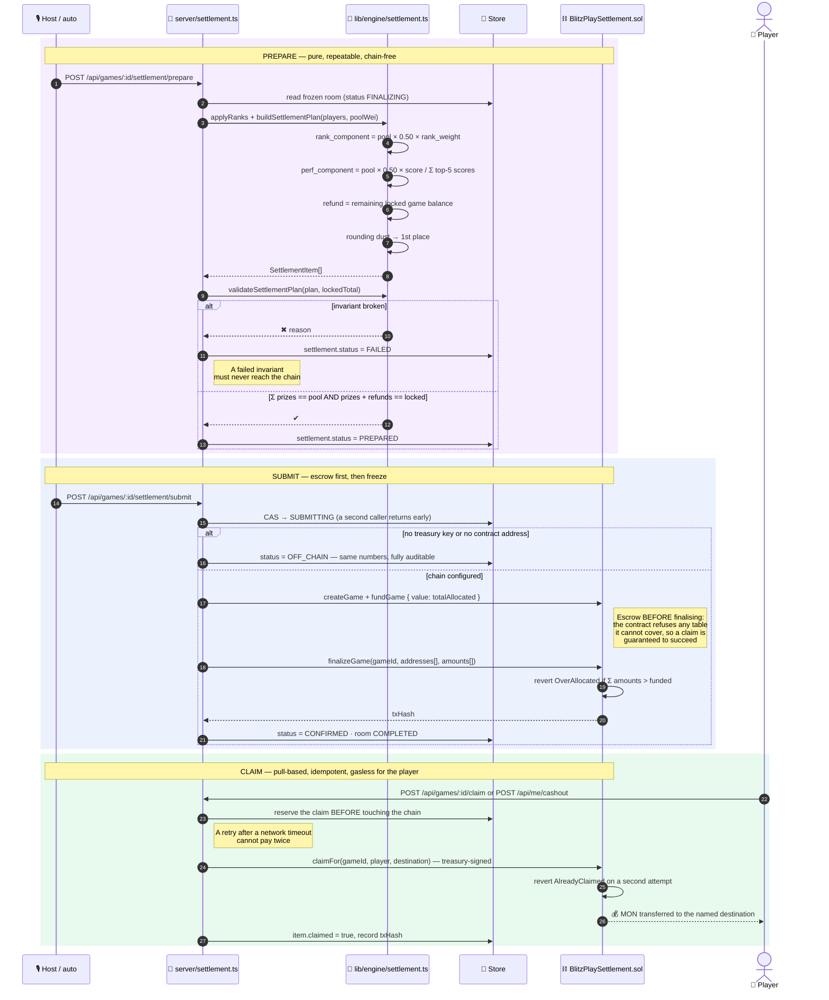

### Why claims are treasury-sponsored

Players hold no MON, so they cannot pay gas. The treasury submits `claimFor` on their behalf and **the contract enforces that funds go to the player's own destination** — the operator can decide the split, but can never take back what is owed. Cash-outs across multiple games are looped **sequentially on purpose**: they are treasury-signed transactions from one account, and firing them concurrently races the nonce. One game failing does not abandon the rest.

---

## 🔐 Authentication & Embedded Wallets

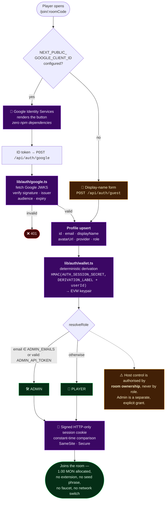

**Why not Privy or RainbowKit?** `@privy-io/react-auth` v3 pulls ~200 transitive Solana packages, and RainbowKit brings wagmi, a query client, a WalletConnect project id and a provider around the whole tree — to deliver the one thing this app actually needs: Google auth plus an automatic EVM wallet. Google Identity Services meets that requirement with **zero npm dependencies**, and `components/shared/use-wallet.ts` speaks **EIP-1193 directly with EIP-6963 discovery** in ~200 lines. `lib/auth/session.ts` is the documented swap seam if Privy is ever wanted back.

> ⚠️ **Consequence, stated plainly:** derived wallets are **custodial**. That is what makes cash-out gasless for players who hold no MON, and it is clearly labelled as a testnet demo property.

---

## 💰 Economy & Scoring

### Rules

| Rule | Value |
|---|---|
| Round length | **10 seconds** (+750 ms latency grace) |
| Intermission | 5 seconds |
| Pre-round countdown | 3 seconds |
| Correct answer | **100 points + up to 50 speed bonus** |
| Wrong answer / timeout | 0 points, **−0.10 MON** |
| Elimination | after **5 penalties**, or at a zero balance |
| Player allocation | **1.00 MON** — 0.50 to the prize pool, 0.50 locked as game balance |
| Prize pool | every 0.50 contribution **+ every penalty collected** |
| Payout | **top 5** — 50 % rank-weighted + 50 % score-weighted |
| Default room cap | 25 players |

### Speed bonus

```
remaining_ratio = clamp((endsAt − receivedAt) / (endsAt − startedAt), 0, 1)
score           = 100 + round(50 × remaining_ratio)
```

`receivedAt` is the **server** receipt time. It is the only timing the engine trusts — a client timestamp is recorded for diagnostics and never scored.

### Prize split

Rank weights for places 1–5 are **35 / 25 / 18 / 13 / 9 %** (`RANK_WEIGHTS_BPS = [3500, 2500, 1800, 1300, 900]` basis points).

```
rank_component_i        = pool × 0.50 × rank_weight_i
performance_component_i = pool × 0.50 × (score_i / Σ top-5 scores)
final_prize_i           = rank_component_i + performance_component_i
refund_i                = remaining locked game balance
```

With fewer than five players the rank weights are **renormalised** over the available places so the whole pool is still distributed. If nobody scored, the performance half falls back to the rank weights rather than dividing by zero. Rounding dust — at most a few wei — is added to first place.

### The invariants

All arithmetic is **bigint wei**, so these hold exactly and are checked by `validateSettlementPlan` before anything reaches the chain:

```
Σ prizes            ==  prizePoolWei
Σ prizes + Σ refunds ==  1.00 MON × players who joined
```

*Verified end-to-end: a 6-player game allocated exactly 6 MON.*

---

## 🗄️ Data Model

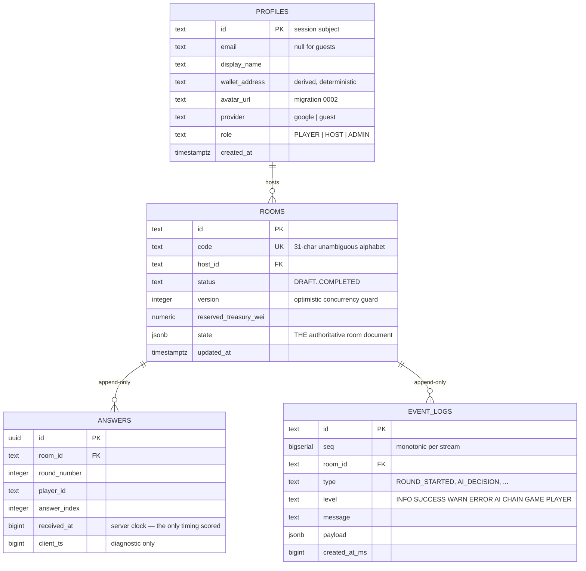

### What lives inside `rooms.state`

One JSONB document, written **only at round transitions**, so 25 players answering at once never contend on it:

```
RoomState
├── config          mode · topic · difficulty · questionCount · maxPlayers · aiGameMasterEnabled
├── players         Record<playerId, PlayerGameState>
│                   score · correct/wrong/timeout counts · penaltyTotalWei
│                   startingGameBalanceWei · currentGameBalanceWei · eliminated · rank
├── challenges      Challenge[]  ← includes correctAnswerIndex + explanation (server-only)
├── rounds          RoundRecord[]  startedAt · endsAt · gradedAt · difficulty
├── leaderboard     LeaderboardEntry[] with rank delta
├── aiDecisions     AiDecision[] — proposal, reason, confidence, metrics, fallbackUsed
├── settlement      Settlement — status · pool · items[] · txHash
└── version         bumped on every committed write
```

### The three indexes that matter

| Index | Purpose |
|---|---|
| `answers_one_per_round_idx` — `UNIQUE (room_id, round_number, player_id)` | Makes one-answer-per-round **atomic** under concurrency. `SupabaseStore.insertAnswer` maps PG `23505` to `'duplicate'`. |
| `event_logs_room_seq_idx` — `(room_id, seq DESC)` | Cheap incremental tailing of the host terminal via `?sinceSeq=`. |
| GIN on `rooms.state` *(migration 0002)* | Powers rooms-by-player: `state @> '{"players":{"<id>":{}}}'`. |

**RLS is enabled on every table with no permissive policy.** All access goes through the server using the service-role key, which bypasses RLS. The browser never reads or writes these tables directly — verified: the anon key is denied on every table with `42501`.

### Two snapshot shapes, one chokepoint

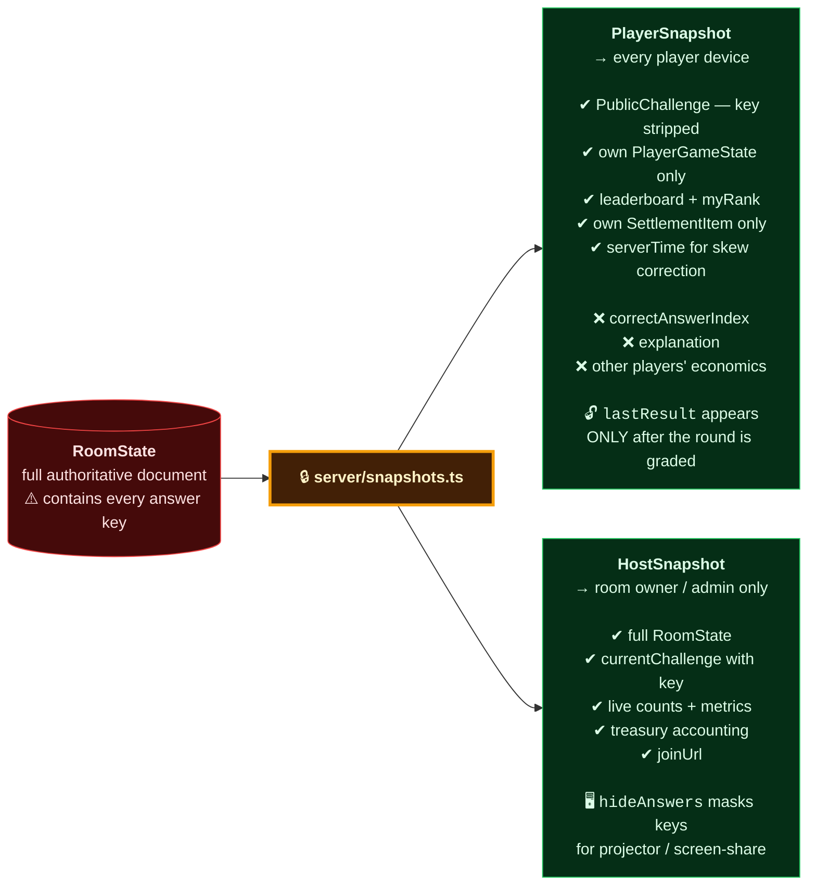

> **Where to be careful:** anything added to `server/snapshots.ts` reaches a player's device. `tests/security.test.ts` asserts the answer key never appears in a live payload, the event log, or an audio filename.

---

## ⛓️ Smart Contract

`contracts/BlitzPlaySettlement.sol` — Solidity `^0.8.24`, no external dependencies, compiled with `solc-js`.

### Design constraints

- No realtime game state on chain. The server is the authority for scores, penalties and rankings; the contract only **escrows funds and enforces that payouts can never exceed what was funded**.
- One settlement transaction per game, not one per answer.
- **Pull-based claims** so a single failing recipient cannot block a payout, with an operator-sponsored variant for players whose embedded wallet holds no gas.
- Double claims are impossible; over-allocation is impossible.

### Interface

| Function | Access | Purpose |
|---|---|---|
| `createGame(bytes32 gameId, uint256 playerLimit)` | `payable` · operator | Register a room and optionally fund it in the same transaction |
| `fundGame(bytes32 gameId)` | `payable` · operator | Add escrow before finalisation |
| `registerPlayers(bytes32, address[])` | operator | Register participating addresses |
| `finalizeGame(...)` | operator | Freeze the payout table — reverts `OverAllocated` if `Σ amounts > funded` |
| `claim(bytes32)` | player | Claim to `msg.sender` |
| `claimTo(bytes32, address)` | player | Claim to a chosen destination |
| `claimFor(bytes32, address player, address destination)` | operator | **Gasless** claim on the player's behalf — funds still go to the player's destination |
| `sweepUnallocated(bytes32, address)` | operator | Recover only what was never allocated to anyone |
| `getGame` · `entitlementOf` · `hasClaimed` | view | Public accounting |

**Guards:** `onlyOperator`, a `nonReentrant` latch, and typed custom errors — `NotOperator`, `GameExists`, `GameMissing`, `AlreadyFinalized`, `NotFinalized`, `LengthMismatch`, `OverAllocated`, `NothingToClaim`, `AlreadyClaimed`, `TransferFailed`, `Reentrant`, `ZeroAddress`.

**Trust model.** The operator is the treasury that funded the game. It can decide the split — computed deterministically off-chain — but it **can never pay out more than it deposited, and can never take back funds still owed to a player**. That is deliberate: the same power that would let it reclaim unclaimed escrow would also let it rob real players.

### ⛽ Gas on Monad — it bills the LIMIT, not the usage

> **This is the single most expensive thing to get wrong here.** On most EVM chains an over-generous gas limit is free; **Monad charges all of it.** Left to itself, viem takes the node's `eth_estimateGas` answer, which came back around 5.4 M for a call doing a handful of storage writes — roughly **0.55 MON per transaction** at 102 gwei.

`lib/chain/settlement.ts` therefore sets an explicit `gas` on **every** write. Measured over a real 6-player settlement:

| | Three writes | Projected 25-player game |
|---|---|---|
| With explicit limits | **0.09 MON** | **~0.62 MON** |
| Estimator defaults | ~1.67 MON | ~15 MON |

**If you add a contract write, give it a limit.** Size it from what the call actually does and leave roughly 2× headroom — too low reverts out-of-gas and *still costs the full limit*.

---

## 🔌 API Reference

Every handler runs through `server/http.ts` — `handle()` for uniform error mapping, `parseBody()` for Zod validation, `requireUser()` / `requireAdmin()` for authorisation.

<details open>
<summary><b>🔑 Auth</b></summary>

| Method | Endpoint | Auth | Description |
|---|---|---|---|
| `POST` | `/api/auth/google` | — | Verify a Google ID token against JWKS, issue a session |
| `POST` | `/api/auth/guest` | — | Display-name sign-in (identical sessions and wallets) |
| `POST` | `/api/auth/name` | user | Update display name |
| `POST` | `/api/auth/admin` | token | Exchange `ADMIN_API_TOKEN` for an admin session |
| `GET` | `/api/auth/me` | user | Current session, role, wallet address |
| `POST` | `/api/auth/logout` | user | Clear the session cookie |

</details>

<details open>
<summary><b>🚪 Rooms — host-owned</b></summary>

| Method | Endpoint | Auth | Description |
|---|---|---|---|
| `POST` · `GET` | `/api/rooms` | user | Create a room / list rooms you host |
| `GET` | `/api/rooms/:roomId` | host | Full `HostSnapshot` |
| `GET` | `/api/rooms/code/:code` | — | Resolve a join code to a room |
| `GET` | `/api/rooms/:roomId/qr` | host | QR PNG for the join URL |
| `POST` | `/api/rooms/:roomId/join` · `/leave` | user | Join / leave the lobby |
| `GET` · `POST` | `/api/rooms/:roomId/questions` | host | List / replace the question set |
| `POST` | `/api/rooms/:roomId/questions/generate` | host | AI generation — 45 s budget, 4 attempts |
| `POST` | `/api/rooms/:roomId/questions/seed` | host | Load the deterministic seed pool |
| `PATCH` · `DELETE` | `/api/rooms/:roomId/questions/:questionId` | host | Approve / reject / edit / remove |
| `POST` | `/api/rooms/:roomId/start` · `/pause` · `/resume` · `/skip` · `/end` | host | Lifecycle control |

</details>

<details open>
<summary><b>🎮 Games — player-facing</b></summary>

| Method | Endpoint | Auth | Description |
|---|---|---|---|
| `GET` | `/api/games/:gameId/state` | player | `PlayerSnapshot` — **also drives `advanceGame`** |
| `POST` | `/api/games/:gameId/answer` | player | Submit an answer. Returns acceptance, **never correctness** |
| `POST` | `/api/games/:gameId/tick` | host | Explicit clock tick from the dashboard |
| `GET` | `/api/games/:gameId/leaderboard` | player | Ranked standings with deltas |
| `GET` | `/api/games/:gameId/logs` | host | Event stream, incremental via `?sinceSeq=` |
| `GET` | `/api/games/:gameId/ai-decisions` | host | Game Master decision history |
| `POST` | `/api/games/:gameId/settlement/prepare` · `/submit` | host | Compute / push the payout table |
| `POST` | `/api/games/:gameId/claim` | player | Claim one game's payout |

</details>

<details open>
<summary><b>👤 Account & wallet</b></summary>

| Method | Endpoint | Auth | Description |
|---|---|---|---|
| `GET` | `/api/me/overview` | user | Aggregated hosted + played rooms, totals, records |
| `GET` | `/api/me/wallet` | user | Ready to cash out · locked in games · on-chain balance |
| `POST` | `/api/me/cashout` | user | Claim **every** settled game to one address, sequentially |
| `POST` | `/api/me/send` | user | Transfer from the embedded wallet |
| `GET` | `/api/me/qr` | user | QR for the wallet address |

</details>

<details open>
<summary><b>🛠️ Admin</b></summary>

| Method | Endpoint | Auth | Description |
|---|---|---|---|
| `GET` | `/api/admin/overview` | admin | Cross-room state, treasury, live-vs-fallback integration status |
| `POST` | `/api/admin/reset` | admin | ⚠️ Destructive — wipe all demo rooms, answers and events |

</details>

### Three meanings of "balance"

The wallet card says which, because they are genuinely different things:

| Shown as | Is |
|---|---|
| **Ready to cash out** | settled payouts not yet claimed |
| **Locked in games** | `currentGameBalanceWei` in rooms that have not finished |
| **On chain** | native balance of the embedded address |

The on-chain figure is normally **zero, and that is correct** — a claim pays straight out to whatever destination the player names, so the embedded address is an *identity, not a purse*. The exception is the pinned admin wallet, which is a real funded account.

---

## 🤖 The AI Game Master

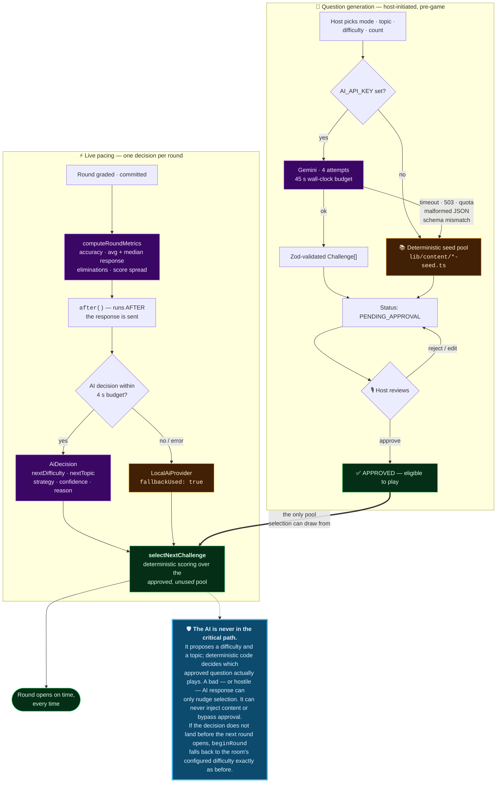

---

## 📁 Repository Layout

```
buzzin/
│
├── app/                              Next.js App Router
│   ├── page.tsx                      landing
│   ├── layout.tsx                    root shell, metadata, fonts
│   ├── globals.css                   Tailwind v4 tokens + ink scale
│   ├── join/[roomCode]/              📱 QR landing → sign-in → join
│   ├── play/[gameId]/                📱 the player's game
│   ├── host/                         🎙️ host home + /[roomId] dashboard
│   ├── admin/                        🛠️ platform overview
│   ├── dashboard/  profile/          👤 account surface
│   └── api/                          typed route handlers (auth · rooms · games · me · admin)
│
├── components/
│   ├── player/    join-flow · lobby · game-screen · answer-grid · results-screen
│   ├── host/      dashboard · question-review · ai-panel · player-table
│   │              settlement-panel · share-panel · terminal
│   ├── account/   shell · dashboard · profile · transfer · qr-scanner · avatar
│   ├── admin/     overview
│   └── shared/    session · sign-in · ui · motion · site-chrome · brand
│                  use-room-stream.ts   ← watchdog poller + realtime accelerator
│                  use-wallet.ts        ← EIP-1193 + EIP-6963, zero dependencies
│
├── server/                           🔒 server-only orchestration
│   ├── game.ts        advanceGame state machine, submitAnswer, pause/skip/end
│   ├── rooms.ts       lifecycle, ownership auth, treasury reservation
│   ├── settlement.ts  prepare → submit → claim
│   ├── snapshots.ts   ⚠️ the ONLY chokepoint for what leaves the server
│   ├── account.ts     cross-room aggregation + cash-out
│   ├── wallet.ts      embedded-wallet balance and transfers
│   ├── events.ts      append-only event log
│   └── http.ts        handle · ok · fail · parseBody · requireUser/Admin
│
├── lib/
│   ├── engine/        🧮 PURE — scoring · leaderboard · metrics · prize maths
│   ├── store/         persistence seam: RoomStore + Supabase and memory impls
│   ├── ai/            provider interface · Gemini adapter · deterministic fallback
│   ├── auth/          Google JWKS verification · sessions · wallet derivation
│   ├── chain/         viem client · ABI · Monad config · settlement calls
│   ├── content/       seeded Quiz / Songless / Wordless pools
│   ├── realtime/      broadcast + the single source of the topic string
│   ├── util/          ids · money · cx · button-class · scan-address · demo-date
│   ├── config.ts      every env value with a safe demo default
│   ├── types.ts       shared server↔client contracts
│   └── validation.ts  Zod schemas for every request body
│
├── contracts/BlitzPlaySettlement.sol
├── supabase/migrations/              0001_init.sql · 0002_profile_avatar.sql
├── scripts/                          audio gen · contract build/deploy · verifiers · ops
├── tests/                            156 unit + integration tests (vitest)
├── public/audio/                     12 synthesised public-domain clips
└── vercel.json                       pins framework: nextjs — see Operational Notes
```
---

## 🧰 Tech Stack

| Layer | Choice | Notes |
|---|---|---|
| Framework | **Next.js 16** App Router | Server Components, route handlers, `after()` for post-response work |
| UI | **React 19** · Tailwind CSS v4 · Framer Motion | Design tokens in `globals.css`; ambient wash is landing-only |
| Language | **TypeScript 5.9**, strict | `npm run typecheck` is a release gate |
| Validation | **Zod** | Every request body, and every AI response |
| Database | **Supabase Postgres** | JSONB room document + append-only answers/events, RLS on |
| Realtime | **Supabase Realtime** broadcast | Accelerator only — polling is the guaranteed transport |
| Auth | **Google Identity Services** | Server-side JWKS verification, zero npm dependencies |
| Chain | **viem** → Monad Testnet (10143) | Explicit gas limits on every write |
| Contract | **Solidity 0.8.24**, `solc-js` | No OpenZeppelin, no external dependencies |
| AI | **Gemini** (`gemini-3.6-flash`) | Behind a provider interface with a deterministic fallback |
| QR | `qrcode` + `jsqr` | Generation server-side, scanning in-browser |
| Testing | **Vitest** | 156 tests, plus HTTP and on-chain verifiers |
| Hosting | **Vercel** | Serverless — which is exactly why there is no worker |

---

## ⚙️ Configuration

Copy `.env.example` → `.env.local`. **Every value is optional to start.**

<details open>
<summary><b>Core</b></summary>

| Variable | Default | Purpose |
|---|---|---|
| `NEXT_PUBLIC_APP_URL` | `http://localhost:3000` | Base URL encoded into every join QR |
| `AUTH_SESSION_SECRET` | dev fallback | ⚠️ **Required in production.** Signs sessions **and derives every wallet address** |
| `DEMO_MODE` | `true` | Enables demo treasury accounting and reset tooling |

</details>

<details open>
<summary><b>Auth · Database · AI</b></summary>

| Variable | Effect if blank |
|---|---|
| `NEXT_PUBLIC_GOOGLE_CLIENT_ID` | Guest sign-in — identical sessions and wallets |
| `NEXT_PUBLIC_SUPABASE_URL` · `NEXT_PUBLIC_SUPABASE_ANON_KEY` · `SUPABASE_SERVICE_ROLE_KEY` | In-process store, single instance only |
| `AI_PROVIDER` · `AI_MODEL` · `AI_API_KEY` | Deterministic Game Master + approved seed pool |
| `ADMIN_EMAILS` · `ADMIN_API_TOKEN` · `ADMIN_WALLET_ADDRESS` | No admin surface; hosting is unaffected |

</details>

<details open>
<summary><b>Monad</b></summary>

| Variable | Default |
|---|---|
| `NEXT_PUBLIC_MONAD_RPC_URL` | `https://testnet-rpc.monad.xyz` |
| `NEXT_PUBLIC_MONAD_CHAIN_ID` | `10143` |
| `NEXT_PUBLIC_MONAD_EXPLORER_URL` | `https://testnet.monadvision.com` |
| `NEXT_PUBLIC_SETTLEMENT_CONTRACT_ADDRESS` | blank → `OFF_CHAIN` settlement |
| `TREASURY_PRIVATE_KEY` | 🔒 **Server-only. Never expose to the browser.** |

</details>

<details open>
<summary><b>Economy — all tunable</b></summary>

| Variable | Default |
|---|---|
| `DEMO_TOTAL_TREASURY` | `25` MON |
| `DEFAULT_PLAYER_ALLOCATION` | `1` MON |
| `DEFAULT_GAME_BALANCE` | `0.5` MON |
| `DEFAULT_PRIZE_POOL_ALLOCATION` | `0.5` MON |
| `WRONG_ANSWER_PENALTY` | `0.1` MON |
| `MAX_WRONG_ANSWERS` | `5` |
| `DEFAULT_ROOM_CAP` | `25` |

</details>

---

## 🪂 Graceful Degradation

Every external dependency is optional, and **every fallback is visible in the admin dashboard** rather than hidden — so a fallback is never mistaken for the real thing.

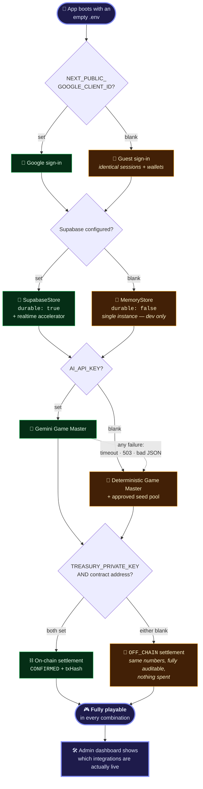

---

## 🛡️ Security Model

| Property | How it is enforced |
|---|---|
| **Answer keys never reach a device mid-round** | Not in the payload, not in the event log, not in an audio filename. `buildPlayerSnapshot` is the only exit; `tests/security.test.ts` asserts it. |
| **Sessions** | Signed HTTP-only cookies, compared in **constant time**. |
| **Host control** | Authorised by **room ownership**, not role. Admin is a separate, explicit grant — an allowlisted email or the operator token — and is **never implied**. |
| **Secrets stay server-side** | Service-role key, treasury key and AI key never reach a client bundle. |
| **Idempotent settlement** | A claim is reserved **before** the chain is touched, so a retry after a timeout cannot pay twice — and the contract independently rejects a double claim. |
| **One answer per round** | A database unique index, not application logic. |
| **Un-enumerable room codes** | Random from a 31-character unambiguous alphabet. |
| **AI cannot inject content** | It proposes difficulty and topic only; selection is deterministic over the host-approved pool. |
| **RLS everywhere** | Enabled with no permissive policy — the anon key is denied on every table. |
| **Presentation mode** | `hideAnswers` masks keys on the host dashboard, which is routinely on a projector behind the host. Defaults **on** once the room leaves the lobby. |

<details>
<summary><b>🐛 Bugs found by verification, and fixed</b></summary>

1. **Every player was an admin.** `resolveRole` granted ADMIN to everyone when `ADMIN_EMAILS` was empty and demo mode was on — so in a 25-player room, any player could start/pause/end the game and read answer keys via the host snapshot. The fallback was removed entirely; host control is now ownership-based. Regression test added.
2. **Landing page 500'd in SSR.** A server component imported `cx` from a `'use client'` module. `next build` did not catch it; the HTTP smoke test did.
3. **Demo reset was unusable.** `/api/admin/reset` re-checked `ADMIN_API_TOKEN` as a header the dashboard button does not send. The grant already requires the token upstream, so the redundant check was removed.
4. **The Game Master blocked the round transition.** Its latency landed as dead air after every round, freezing the screen of whichever player's poll happened to trigger grading. It now runs after the commit and after the response, via `after()`.
5. **Every game ended after round one.** `beginRound` returned null for both "another request won the race" and "out of content", and the caller treated both as *finish the game*. Splitting `raced` from `exhausted` fixed it.

</details>

---

## 🚀 Getting Started

### Prerequisites

- **Node.js ≥ 20**
- npm
- *(optional)* Supabase project, Google OAuth client, Gemini API key, funded Monad testnet account

### Install and run

```bash
git clone https://github.com/mohdkaunain/Buzzin-Monad.git
cd Buzzin-Monad

npm install
cp .env.example .env.local     # every value is optional to start
npm run dev
```

Open **http://localhost:3000**. Create a room from **Host a game**, then open the join link in a second browser profile to play against yourself.

### Your first game in six steps

```mermaid
flowchart LR
    S1["1️⃣ <b>Host a game</b><br/>name · mode · topic<br/>difficulty · question count"] --> S2["2️⃣ <b>Generate questions</b><br/>AI, or load the seed pool"]
    S2 --> S3["3️⃣ <b>Review & approve</b><br/>edit or reject anything<br/><i>min 3 approved to start</i>"]
    S3 --> S4["4️⃣ <b>Share the QR</b><br/>put it on the big screen"]
    S4 --> S5["5️⃣ <b>Players join</b><br/>scan → sign in → wallet<br/>+ 1.00 MON allocated"]
    S5 --> S6["6️⃣ <b>Start</b><br/>3 s countdown, then<br/>10 s rounds until done"]
    S6 --> S7(["🏆 Settlement opens<br/>players cash out"])

    classDef s fill:#3b0764,stroke:#a855f7,color:#f3e8ff
    classDef e fill:#052e16,stroke:#22c55e,stroke-width:2px,color:#dcfce7
    class S1,S2,S3,S4,S5,S6 s
    class S7 e
```

---

## 🧪 Testing & Verification

Three independent layers, because unit tests alone would not have caught any of the five bugs above.

```bash
npm test              # 156 unit + integration tests (vitest)
npm run typecheck     # tsc --noEmit
npm run lint          # eslint
npm run build         # 48 routes

npm run verify:flows  # 86 end-to-end checks against a running server
node scripts/verify-chain.mjs   # 16 live on-chain guarantee checks
```

| Suite | Covers |
|---|---|
| `scoring.test.ts` | Speed bonus, penalty capping, elimination thresholds, timeout parity |
| `settlement.test.ts` | Prize maths, renormalisation under 5 players, dust handling, invariants |
| `game-flow.test.ts` | Full lifecycle, concurrent ticks, race handling, pause/resume/skip |
| `security.test.ts` | Answer-key leakage, role escalation, host-vs-admin authorisation |
| `ai.test.ts` | Provider fallback, malformed responses, schema rejection |
| `content.test.ts` | Seed pool integrity across all three modes |
| `contract.test.ts` | ABI encoding, game-id hashing, gas-limit presence |
| `account.test.ts` · `scan-address.test.ts` | Aggregation, cash-out looping, address parsing |

**`verify:flows`** drives the real HTTP API as a host plus six players: sign in, create, approve, join, start, answer under the clock, get eliminated, settle, cash out — asserting the security properties along the way. It needs `ADMIN_API_TOKEN` exported to exercise the admin path, and takes `BASE_URL` to run against a deployment.

**`verify-chain.mjs`** runs 16 live checks against the deployed contract and **spends real testnet MON** (~0.005). It is deliberately not a package script.

---

## 📦 Deployment

Full step-by-step instructions live in **[DEPLOYMENT.md](./DEPLOYMENT.md)**. The short version:

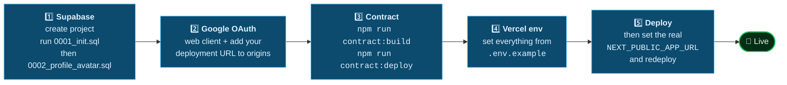

### Utility scripts

| Command | What it does |
|---|---|
| `npm run gen:audio` | Synthesises the 12 Songless clips from public-domain melodies |
| `npm run contract:build` | Compiles the Solidity contract with `solc-js` |
| `npm run contract:deploy` | Deploys to the configured Monad network |
| `npm run treasury:status` | Treasury balance + contract wiring check |
| `npm run reclaim:escrow` | Sweeps **guest** payouts back to the treasury — dry-runs unless given `--confirm` |
| `npm run vercel:env` | Pushes local env values to the Vercel project |

---

## 🔧 Operational Notes

> These are the things that cost real money or real downtime to rediscover.

<details open>
<summary><b>⚠️ Four identifiers you must change together, or not at all</b></summary>

The product is BuzzIn everywhere a person can read it. Three identifiers deliberately kept their pre-rename spelling, because changing any of them costs real funds:

| Identifier | Why it cannot move alone |
|---|---|
| `DERIVATION_LABEL` in `lib/auth/wallet.ts` | Hashed into every player's private key. Renaming changes **every address**, exactly like rotating `AUTH_SESSION_SECRET`, and strands whatever the live contract holds for them. |
| `gameIdFor` in `lib/chain/client.ts` | Hashes `blitzplay:<roomId>` into the on-chain game id. Every settled game is stored under an id computed that way; a new prefix orphans that escrow. `scripts/reclaim-escrow.mjs` duplicates this function and must stay in step. |
| `BlitzPlaySettlement.sol` | The source of the deployed contract. Renaming changes the artifact, which would no longer correspond to what is on chain. |
| `NEXT_PUBLIC_APP_URL` / the Vercel project | Whatever URL you deploy to is what every join QR encodes, and the Google origin allowlist is pinned to it. Renaming after printing codes invalidates them. |

</details>

<details open>
<summary><b>💧 Reclaim escrow BEFORE resetting demo data, never after</b></summary>

`scripts/reclaim-escrow.mjs` finds what to sweep by reading room documents out of Supabase and hashing each id into its on-chain game id. The admin demo reset deletes exactly those rows. Reset first and the escrow is still in the contract but **nothing knows which game ids to claim against** — the script reports `0 across 0 rooms` while the contract plainly still holds a balance.

The cheap habit: run `npm run reclaim:escrow --confirm` **before** Admin → Demo tools, or rehearse with `NEXT_PUBLIC_SETTLEMENT_CONTRACT_ADDRESS` blank so no escrow exists at all.

</details>

<details open>
<summary><b>📌 <code>vercel.json</code> pins <code>framework: nextjs</code>, and it must stay</b></summary>

A Vercel project created with Framework Preset **Other** builds the app correctly — the log shows all 48 routes compiling — and then serves the result as a **static site out of `public/`**. There are no functions and no router, so *every* path returns a platform-level `NOT_FOUND`, while the deployment reads `● Ready` throughout. Nothing in the build output hints at it. Pinning the framework in `vercel.json` rather than the dashboard keeps the fix in version control and applies it to GitHub auto-deploys too.

</details>

<details>
<summary><b>📋 Everything else worth knowing</b></summary>

- **Rehearse with the contract address blank.** Settlement completes as `OFF_CHAIN` — identical numbers, nothing spent. Point at the real contract only for the real run. **~25 MON** is needed for one full 25-player demo.
- **Unclaimed escrow stays locked.** The operator deliberately cannot claw it back, because that power would also let it take funds players are owed. `reclaim:escrow` only sweeps guest payouts, and always skips Google-authenticated accounts.
- **`AUTH_SESSION_SECRET` derives every wallet address.** Set it once before the event; never rotate mid-game.
- **Google origins are not wildcarded.** Every origin you serve from must be listed on the OAuth client, or the button **silently does not render** and players fall back to the display-name form.
- **A finished room releases its demo budget.** `syncReservation` derives what a room holds from its status — a full house in the lobby, only actual joiners once it starts, nothing from `FINALIZING` onward. Released at `FINALIZING` rather than `COMPLETED` on purpose: settlement pays out of the treasury account and never consults this number.
- **The realtime topic comes from one place**, `lib/realtime/topic.ts`. A mismatch between broadcaster and subscriber does not error — it silently kills the push accelerator and leaves polling to carry everything.
- **Gemini's free tier is congested.** 503 "high demand" is common. Retries are per-call — four attempts for host-initiated generation, two for a live decision — each bounded by a wall-clock budget rather than a per-attempt timeout.
- **Keep credentials out of committed files.** `.env.local` is gitignored and is the only place a key belongs.

</details>

---

## 🎼 Licensing of Bundled Content

Songless clips are **synthesised from scratch** by `scripts/generate-audio.mjs`, rendering melodies whose copyright has long expired — Beethoven, Mozart, Pachelbel, Grieg, Rossini, Strauss, plus traditional tunes — as WAVs from note lists.

**Nothing is downloaded and no third-party recording is redistributed.** No music API outage can break the mode, and filenames are opaque (`track-07.wav`) so they cannot leak answers. `lib/content/songless-seed.ts` is the provider seam where a licensed catalogue would slot in.

---

## 📄 License

Released under the **MIT License**. See [`LICENSE`](./LICENSE) for details.

---

<div align="center">

### Built for Monad

**[Report an issue](https://github.com/mohdkaunain/Buzzin-Monad/issues)** · **[Deployment guide](./DEPLOYMENT.md)** · **[Engineering notes](./CLAUDE.md)**

<sub>Monad Testnet · chain 10143 · MON is testnet currency with no monetary value</sub>

</div>
